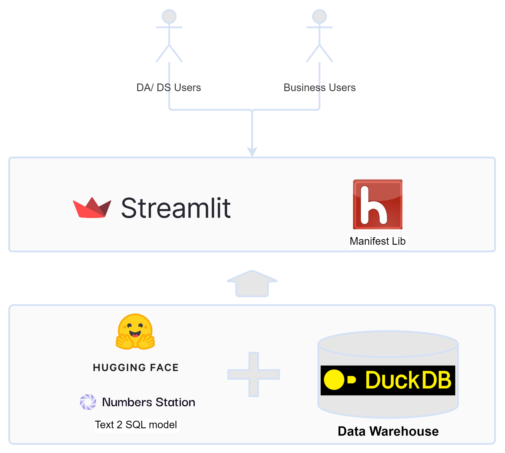
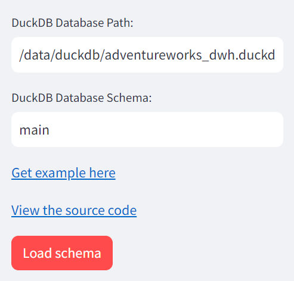
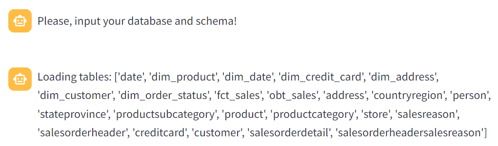

# Private Generative AI Model For Data Analytics On Your Data Warehouse
This repository helps to build a private AI in SQL analytics with generative models

<p align="center">
    
</p>

# The Contents
- [Introduction](#introduction)
- [Build a SQL Chatbot powered by the generative AI model](#build-a-sql-chatbot-powered-by-the-generative-ai-model)
  - [Start server to serving a Text-to-SQL model](#start-server-to-serving-a-text-to-sql-model)
  - [Build a SQL chat bot application with Streamlit framework](#build-a-sql-chat-bot-application-with-streamlit-framework)
- ✨ [Demo](#demo)
- 💖 [Supporting Links](#supporting-links)

# Introduction
The Text-to-SQL model is a groundbreaking advancement in the fusion of natural language processing and data analytics. It enables computers to comprehend and translate everyday language into structured SQL queries, revolutionizing how we interact with databases.

Text-to-SQL eliminates the need for complex SQL syntax, allowing users to query databases using plain language. This breakthrough technology caters to data professionals and newcomers alike, making data retrieval and analysis more intuitive.

Leveraging the Text-to-SQL model, we can build an SQL chat-bot—an interactive bridge between users and their databases. This chat-bot understands natural language queries, translates them into SQL, and executes them on the database.

In this exploration, we'll guide you through setting up and using this SQL chat-bot. By democratizing data access, we're simplifying analytics and empowering a wider audience to tap into the potential of their data.

# Build a SQL chat-bot powered by the generative AI model

## Start server to serving a Text-to-SQL model
In this tutorial, we will use the [NSQL model](https://huggingface.co/NumbersStation) to generate SQL from your text input.
NSQL is a family of autoregressive open-source large foundation models (FMs) designed specifically for SQL generation tasks.
Therea are some kind of NSQL models such as `nsql-350M`, `nsql-2B`, `nsql-6B` and the latest `nsql-llama-2-7B` model that are available on the `HuggingFace`.
We will leverage the [Mainifest](https://github.com/HazyResearch/manifest) library to use the `NSQL model`.
You can run following command to start a huggingface local server to server `nsql-350M` model:

```shell
python3 -m manifest.api.app \
    --model_type huggingface \
    --model_generation_type text-generation \
    --model_name_or_path NumbersStation/nsql-350M \
    --device 0
    
The cache for model files in Transformers v4.22.0 has been updated. Migrating your old cache. This is a one-time only operation. You can interrupt this and resume the migration later on by calling `transformers.utils.move_cache()`.
0it [00:00, ?it/s]
[2023-09-25 15:49:08,043] [INFO] [real_accelerator.py:158:get_accelerator] Setting ds_accelerator to cuda (auto detect)
Model Name: NumbersStation/nsql-350M Model Path: NumbersStation/nsql-350M
Downloading (…)okenizer_config.json: 100%|██████████████████████████████████████████████████████████████████████████████████████████████████████████████████████████████████████| 237/237 [00:00<00:00, 1.19MB/s]
Downloading (…)olve/main/vocab.json: 100%|█████████████████████████████████████████████████████████████████████████████████████████████████████████████████████████████████████| 798k/798k [00:00<00:00, 823kB/s]
Downloading (…)olve/main/merges.txt: 100%|█████████████████████████████████████████████████████████████████████████████████████████████████████████████████████████████████████| 456k/456k [00:00<00:00, 648kB/s]
Downloading (…)/main/tokenizer.json: 100%|██████████████████████████████████████████████████████████████████████████████████████████████████████████████████████████████████| 2.11M/2.11M [00:00<00:00, 3.66MB/s]
Downloading (…)in/added_tokens.json: 100%|██████████████████████████████████████████████████████████████████████████████████████████████████████████████████████████████████| 1.08k/1.08k [00:00<00:00, 6.30MB/s]
Downloading (…)cial_tokens_map.json: 100%|█████████████████████████████████████████████████████████████████████████████████████████████████████████████████████████████████████| 99.0/99.0 [00:00<00:00, 643kB/s]
Downloading (…)lve/main/config.json: 100%|██████████████████████████████████████████████████████████████████████████████████████████████████████████████████████████████████| 1.01k/1.01k [00:00<00:00, 8.33MB/s]
Downloading pytorch_model.bin: 100%|████████████████████████████████████████████████████████████████████████████████████████████████████████████████████████████████████████| 1.51G/1.51G [00:38<00:00, 38.8MB/s]
Downloading (…)neration_config.json: 100%|███████████████████████████████████████████████████████████████████████████████████████████████████████████████████████████████████████| 115/115 [00:00<00:00, 967kB/s]
Loaded Model DType torch.float32
Usings max_length: 2048
 * Serving Flask app 'app'
 * Debug mode: off
WARNING: This is a development server. Do not use it in a production deployment. Use a production WSGI server instead.
 * Running on all addresses (0.0.0.0)
 * Running on http://127.0.0.1:5000
 * Running on http://172.22.31.156:5000
Press CTRL+C to quit
```

>NOTE: In this tutorial, we use nsql-350M to minimize required memory and storage.

## Build a SQL chat-bot application with Streamlit framework
### First step: Load database schema

- Get list of tables:
```python
    def get_tables(self) -> List[str]:
        """Get all tables in the database."""

        with self.connect() as conn:
            sql_get_tables = f"SELECT DISTINCT table_name FROM duckdb_tables()"
            table_list = conn.sql(sql_get_tables).fetchall()
            table_names = []
            for table in table_list:
                table_names.append(table[0])

            return table_names
```
- Get detail schema of each table:
```python
    def get_schema(self, table: str) -> Table:
        """Return Table."""

        with self.connect() as conn:
            columns = []
            sql_get_columns = f"SELECT DISTINCT column_name, data_type FROM duckdb_columns() WHERE table_name = '{table}'"
            column_list = conn.sql(sql_get_columns).fetchall()
            for col in column_list:
                columns.append(TableColumn(name=col[0], dtype=col[1]))

            return Table(name=table, columns=columns)
```
- Run a query:
```python
    def run_sql(self, sql: str):
        """Run SQL statement."""
        with self.connect() as conn:
            print(f"Execute query: {sql}")
            return conn.execute(sql).fetchdf()
```

### Second step: Format input query that will be sent to the huggingface server
- Build CREATE table command:
```python
    def format_table(self, table: Table) -> str:
        """Get table format."""
        table_fmt = []
        table_name = table.name
        for col in table.columns or []:
            # This is technically an incorrect type, but it should be a catchall word
            table_fmt.append(f"    {col.name} {col.dtype or 'any'}")
        if table.pks:
            table_fmt.append(
                f"    primary key ({', '.join(pk.name for pk in table.pks)})"
            )
        for fk in table.fks or []:
            table_fmt.append(
                f"    foreign key ({fk.column.name}) references {fk.references_name}({fk.references_column.name})"
                # noqa: E501
            )
        if table_fmt:
            all_cols = ",\n".join(table_fmt)
            create_tbl = f"CREATE TABLE {table_name} (\n{all_cols}\n)"
        else:
            create_tbl = f"CREATE TABLE {table_name}"

        print(f"Table: {create_tbl}")
        return create_tbl

    def format_tables(self, tables: list[Table]) -> str:
        """Get tables format."""
        return self.table_sep.join(self.format_table(table) for table in tables)
```

- Build prompt format:
```python
def format_prompt(
            self,
            instruction: str,
    ) -> str:
        """Get prompt format."""
        sql_prefix = "SELECT"
        return f"""{self.table_str}\n\n\n-- Using valid DuckDB, answer the following questions for the tables provided above.\n\n-- {instruction}\n{sql_prefix}"""  # noqa: E501

```

- Build response format:
```python
    def format_model_output(self, output_sql: str) -> str:
        """Format model output.
        Our prompt ends with SELECT so we need to add it back.
        """
        if not output_sql.lower().startswith("select"):
            output_sql = "SELECT " + output_sql.strip()
        return output_sql
```

For example:
```shell
# List of CREATE table commands
CREATE TABLE work_orders ( ID NUMBER, CREATED_AT TEXT, COST FLOAT, INVOICE_AMOUNT FLOAT, IS_DUE BOOLEAN, IS_OPEN BOOLEAN, IS_OVERDUE BOOLEAN, COUNTRY_NAME TEXT, )

# Prompt format
-- Using valid DuckDB, answer the following questions for the tables provided above.

# You query here
-- how many work orders are open?
```
The response:
```shell
SELECT COUNT(*) FROM work_orders WHERE IS_OPEN = 'Y';
```
> NOTE: You can try this on the [huggingface](https://huggingface.co/NumbersStation/nsql-350M?) website.

### The third step: Build streamlit app
- Build side bar for input the database connection parameters
```python
with st.sidebar:
  duckdb_database_path = st.text_input("DuckDB Database Path:", placeholder="path/to/database.db", key="duckdb_database_path")
  duckdb_schema = st.text_input("DuckDB Database Schema:", placeholder="main", key="duckdb_database_schema")
  "[Get example here](https://duckdb.org/docs/api/python/overview)"
  "[View the source code](https://github.com/streamlit/llm-examples/blob/main/Chatbot.py)"
```

- Load the database schema
```python
@st.cache_resource(ttl="2h")
def load_db():
    db_conn = DuckDBConnector(
        database_path=duckdb_database_path
    )
    db_conn.connect()
    # Load schema
    tables = []
    tables.extend(db_conn.get_tables())

    msg_content = f"Loading tables: {tables}"
    st.session_state.messages.append({"role": "assistant", "content": msg_content})
    st.chat_message("assistant").write(msg_content)
    return db_conn, tables
```

- Get connector and create a formatter
```python
# Get the connector and formatter
if st.sidebar.button("Load schema", type="primary"):
    if (not duckdb_database_path) or (not duckdb_schema):
        st.info("Please add your DuckDB database or/ and schema to continue.")
        st.stop()

    st.session_state.db_cnn, tables = load_db()
    db_schema = [st.session_state.db_cnn.get_schema(table) for table in tables]
    st.session_state.formatter = RajkumarFormatter(db_schema)
```

- Connect to the local `huggingface` server
```python
manifest_client = Manifest(client_name="huggingface", client_connection="http://127.0.0.1:5000")
```

- Chat with bot
```python
if prompt := st.chat_input():
    if (not duckdb_database_path) or (not duckdb_schema):
        st.info("Please add your DuckDB database or/ and schema to continue.")
        st.stop()

    # append user's message
    st.session_state.messages.append({"role": "user", "content": prompt})
    st.chat_message("user").write(prompt)
    # ask the assistant
    response = ask_bot(prompt)
    # append assistant's message
    df = st.session_state.db_cnn.run_sql(response)
    msg_content  = f"{response}"
    st.session_state.messages.append({"role": "assistant", "content": msg_content})
    st.chat_message("assistant").write(msg_content)
    st.dataframe(df)
```

## Demo
### Start the SQL chat-bot application:
To launch the SQL chat-bot application, run following command. Ensure that you've previously installed necessary libraries:

```shell
streamlit run streamlit_app/SQL_chat_bot.sql
```
You can access the SQL chat-bot app through your web browser by navigating to *http://127.0.0.1:8501*
  


The first step, you need to input the DuckDB's database path and database schema: 



Then, click on the `Load schema` button to load the database schema.



Now, we can interact with your SQL bot using natural language queries. For example, you can ask a question like, `Number of rows in the fct_sales table` to retrieve information about the number of rows in the `fct_table` table.


# Conclusion
In this demonstration, we explored a powerful SQL chat-bot application that enables users to interact with their databases using natural language queries. This innovative tool simplifies database interactions and empowers users to obtain insights without the need for complex SQL syntax.

This SQL chat-bot not only enhances effeciency but also bridges the gap between users and their data, making it accessible to a broader audience. Whether you are a seasoned data professional or a newcomer to SQL, this application offers a user-friendly and efficient means of database interaction.

As technology continues to advance, tools like this SQL chat-bot exemplify how innovative solutions can simplify complex tasks and empower individuals to harness the power of their data with ease. The future of data analytics promises exciting possibilities, and applications like this one provide a glimpse into what's achievable.

With its user-friendly interface and natural language capabilities, this SQL chat-bot marks a significant step forward in the realm of data analytics tools, paving the way for more accessible and efficient data exploration and analysis.

# Supporting Links
- [NSQL](https://huggingface.co/NumbersStation)
- [Manifest](https://github.com/HazyResearch/manifest)
- [Streamlit](https://streamlit.io/)